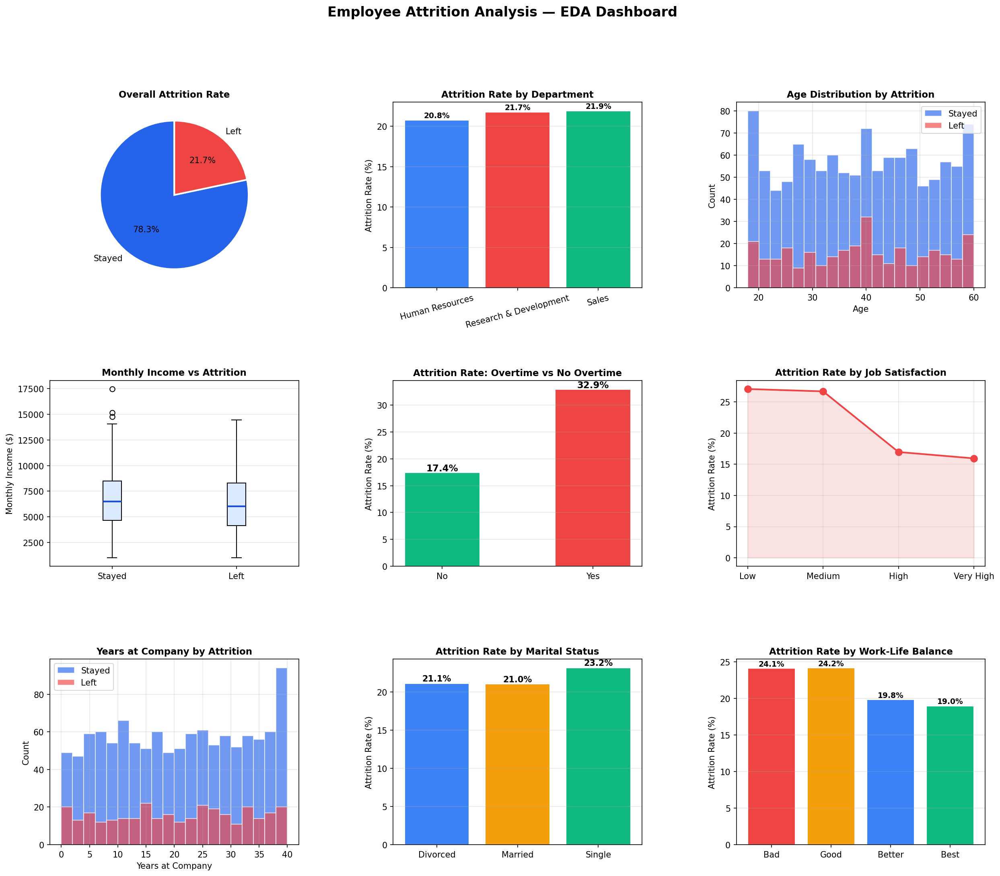
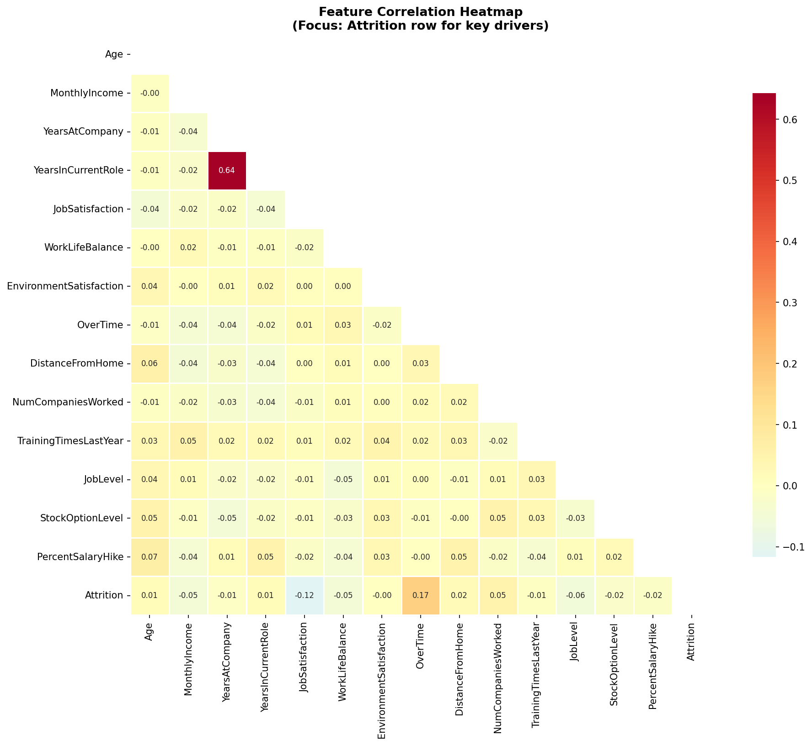
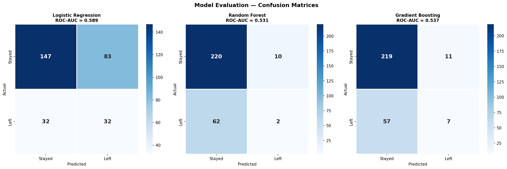
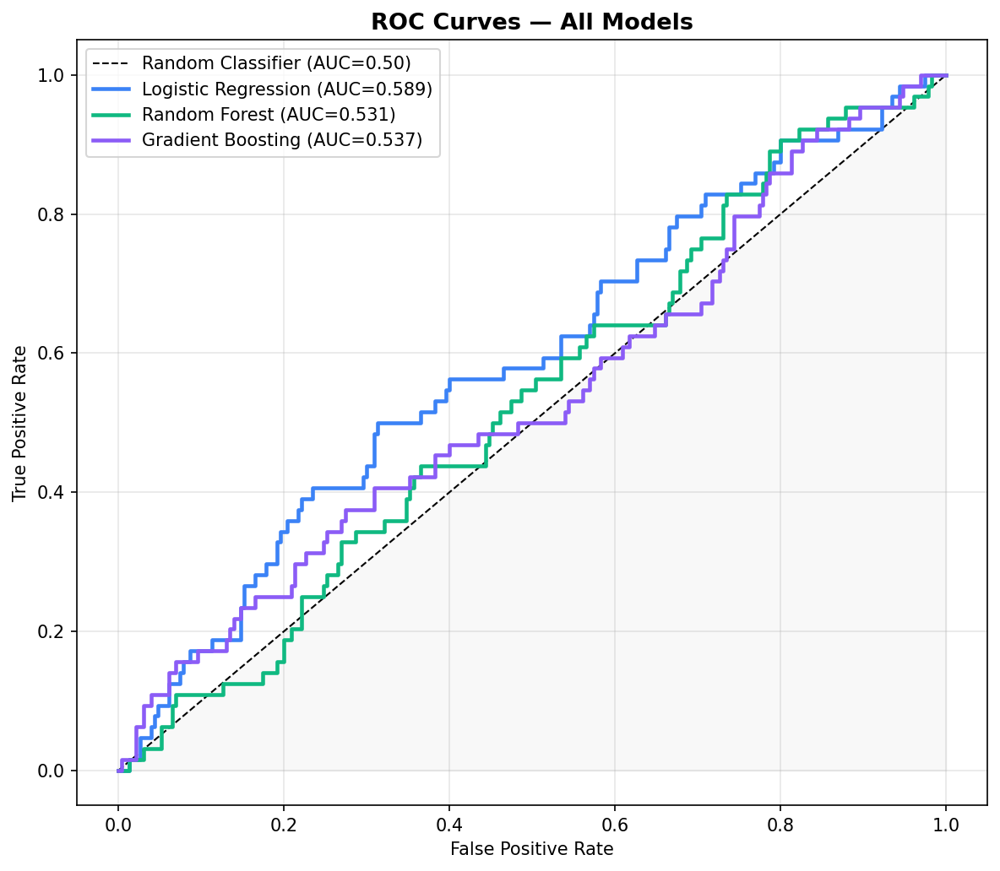
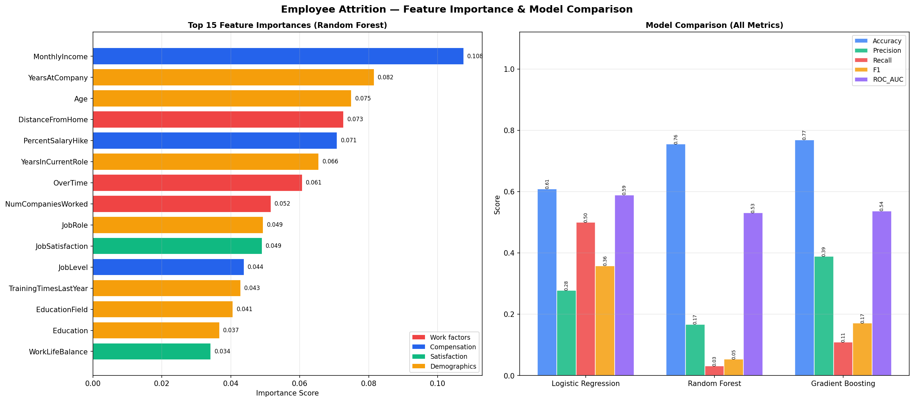
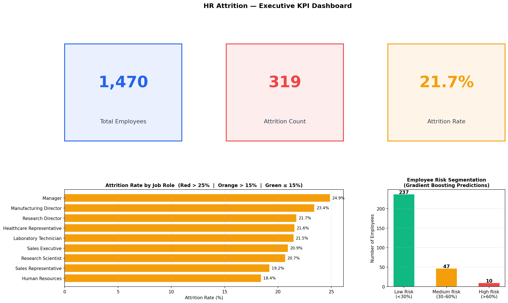

# Employee Attrition Analysis

Predicting and understanding employee turnover using HR analytics and machine learning.

## Models Used
- Logistic Regression
- Random Forest
- Gradient Boosting

## Results
| Model | Accuracy | Precision | Recall | F1 | ROC-AUC |
|---|---|---|---|---|---|
| Logistic Regression | 0.609 | 0.278 | 0.500 | 0.358 | 0.589 |
| Random Forest | 0.755 | 0.167 | 0.031 | 0.053 | 0.531 |
| Gradient Boosting | 0.769 | 0.389 | 0.109 | 0.171 | 0.537 |

## Key Findings
- Overall attrition rate: 21.7%
- Top drivers: Monthly Income, Years at Company, Overtime, Distance from Home
- 10 employees flagged as High Risk (>60% probability of leaving)

## Tech Stack
Python, pandas, scikit-learn, matplotlib, seaborn

## Visualizations

## How to Run
pip install pandas numpy matplotlib seaborn scikit-learn
python employee_attrition.py
